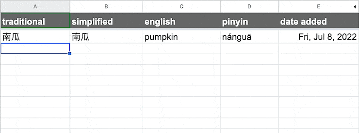

# Chinese-English Magic Spreadsheet 🪄

This is a spreadsheet for studying Chinese which autofills Chinese-English translation as well as traditional and simplified characters and pinyin. It looks like this:

Latest version is available to install from: https://tinyurl.com/chinese-magic-sheet

In progress: There is also an experimental feature to download a selection as audio from Google Translate.